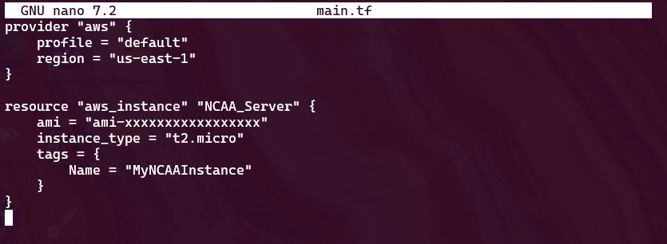
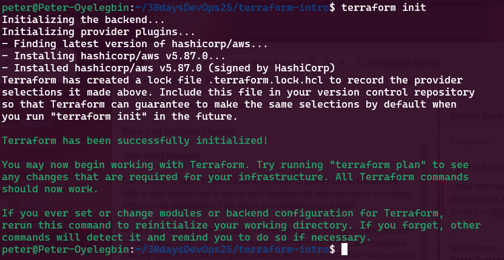
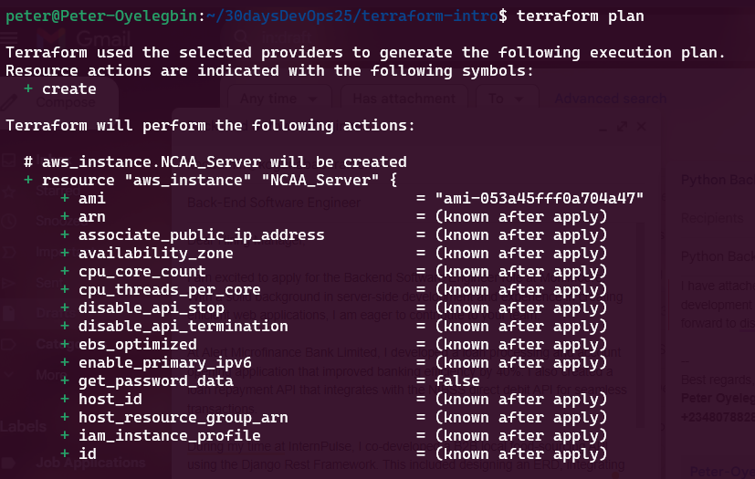
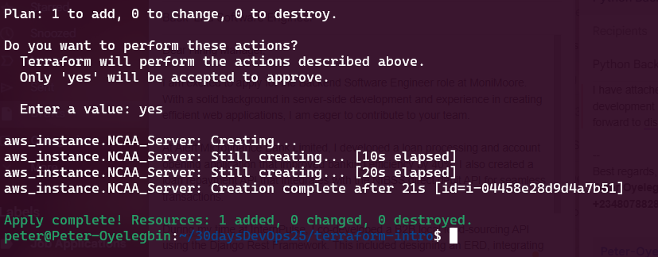
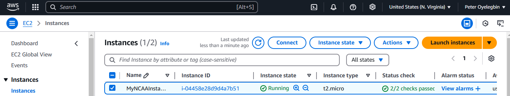
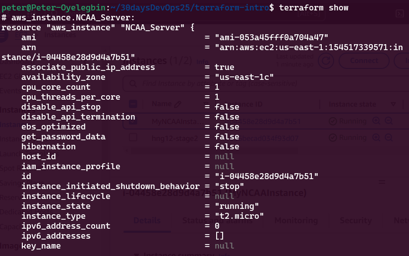

# Terraform NCAA Server Provisioning
**Project Overview:** This project demonstrates how to use Terraform to automate the provisioning of a server on AWS. It serves as a guide for beginners using Infrastructure as Code (IaC) and cloud automation, helping to level up DevOps skills. The project showcases the ability to efficiently provision and manage cloud infrastructure while following best practices in security, scalability, and maintainability.

## Prerequisites
Before you begin, ensure you have the following installed and configured:
1. **AWS CLI**: Install the AWS Command-Line Interface (AWS CLI) to interact with AWS services. Follow the official [AWS CLI installation guide](https://docs.aws.amazon.com/cli/latest/userguide/install-cliv2.html).
2. **AWS Account**: If you don't already have one, create a free AWS account at [AWS Signup](https://aws.amazon.com/).
3. **Terraform**: Download and install Terraform from the official [Terraform website](https://developer.hashicorp.com/terraform/downloads).

## Project Structure
The project follows a well-organized structure to ensure maintainability and scalability:
```
├── main.tf          # Terraform configuration file defining AWS resources
└── README.md        # Project documentation
```

## Getting Started
Follow these steps to provision your AWS server using Terraform:
1. Configure AWS Credentials
Ensure you have configured your AWS credentials by running:
```sh
aws configure
```
Provide your AWS Access Key, Secret Key, default region (us-east-1), and output format (json).

2. Clone the repo
```sh
git clone https://github.com/PeterOyelegbin/terraform-ncaa.git
cd terraform-ncaa
```

3. Update line 7 in main.tf
Login to your AWS account and copy your ami for the free tier
```
ami = "ami-xxxxxxxxxxxxxx"
```


4. Initialize Terraform
Run the following command to initialize Terraform and download the required providers:
```sh
terraform init
```


5. Plan Infrastructure Deployment
Generate an execution plan to preview the infrastructure changes:
```sh
terraform plan
```


6. Apply Terraform Configuration
Deploy the infrastructure by running:
```sh
terraform apply
```
Confirm the prompt by typing `yes` when prompted.


7. Verify Deployment
   - Once Terraform completes the provisioning, check the AWS console
     
   - or use:
     ```sh
     terraform show
     ```
     

8. Destroy Infrastructure
To delete the provisioned resources, run:
```sh
terraform destroy
```
Confirm with `yes` to proceed.


## Additional Resources
- [Terraform Documentation](https://developer.hashicorp.com/terraform/docs)
- [AWS Terraform Provider](https://registry.terraform.io/providers/hashicorp/aws/latest/docs)

## License
This project is open-source and available under the MIT License.
